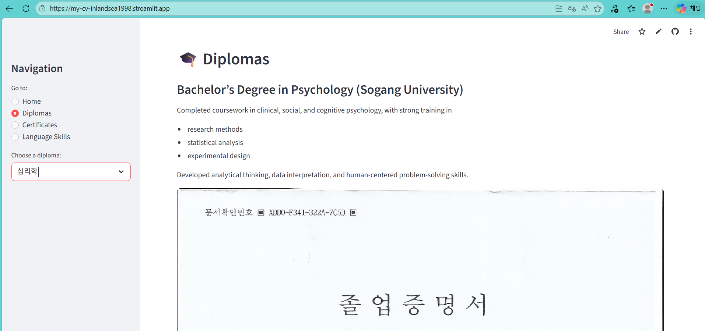

# My CV – Streamlit App

This repository contains a personal CV/resumé web application built with **Streamlit**.  
It highlights my academic background, certifications, professional experiences, and career goals, presented in a clean, interactive format.

---

## 🌐 Live Demo
You don’t need to run this project locally.  
Visit the live CV here: **[ App URL](https://my-cv-inlandsea1998.streamlit.app/)**

---

## 🛠️ Tech Stack
- **Python**
- **Streamlit** for interactive UI
- **Markdown** for content formatting
- **GitHub** for version control and hosting

---

## 🎯 Purpose
This project serves as a digital, interactive CV that can be easily shared with recruiters, colleagues, and collaborators. It demonstrates both my academic journey and practical skills, while showcasing my ability to build and deploy modern web applications.

---

## 📸 Preview
Here’s a screenshot of the CV app in action:

